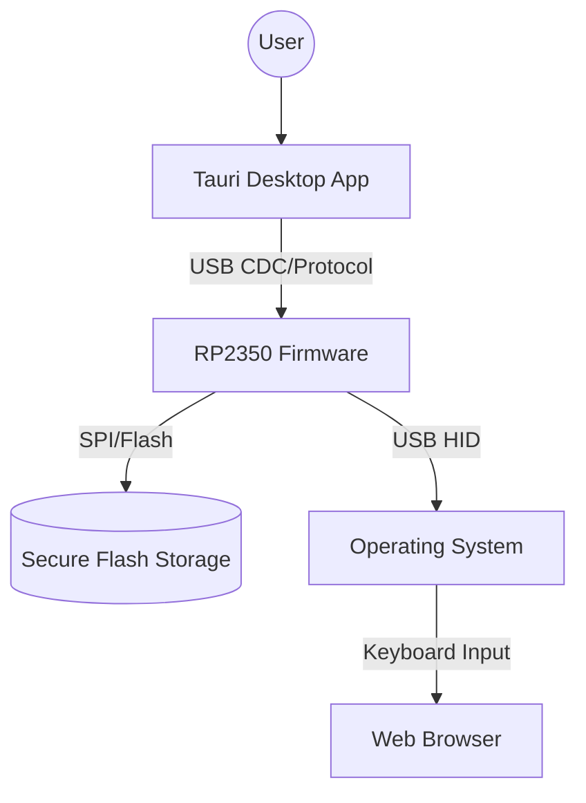

# VaultKey Stack 🔐

VaultKey is a next-generation, open-source hardware security key and password manager built on the **Raspberry Pi RP2350**. Highly optimized for the **Tenstar RP2350-USB (16MB)** development board.

## Supported Hardware
- **Tenstar RP2350-USB**: 16MB Flash, Onboard WS2812 RGB LED (GP22).
- **Generic RP2350**: Configurable via pin headers.

- **FIDO2/CTAP2**: Full WebAuthn support with Resident Credentials and Client PIN (NIST P-256).
- **Encrypted Vault**: AES-256-GCM encrypted storage for passwords and secrets.
- **Argon2id KDF**: Hardware-hardened key derivation from user master PIN.
- **Hardware-Backed Security**: Root of Trust using the RP2350 and internal TRNG.
- **OATH TOTP/HOTP**: Support for 2FA codes with local generation.
- **USB Keyboard Emulation**: Auto-type credentials directly into any application.
- **Cross-Platform App**: Modern desktop management app built with Tauri v2.

## Architecture



## Security Design

1. **Master Key Derivation**: Uses Argon2id (tuned for embedded) to derive a master key from your PIN + salt.
2. **Authenticated Encryption**: All data in flash is protected by AES-GCM (MAC verify before decrypt).
3. **Sensitive Memory Handling**: Buffers containing keys or PINs are zeroed out immediately after use.
4. **Hardware Optimized**: Specifically tuned for the Tenstar RP2350-USB with 16MB flash and RGB LED feedback.
5. **Physical Verification**: Operations like FIDO2 registration or TOTP viewing require a physical button press on the device (GP21 on Tenstar board).

## Getting Started

### Prerequisites
- [Pico SDK](https://github.com/raspberrypi/pico-sdk) (for RP2350 support)
- Rust & Node.js (for the Tauri App)

### Build Firmware
```bash
cd firmware
mkdir build && cd build
cmake ..
make
```
Flash the resulting `vaultkey.uf2` to your device.

### Build Desktop App
```bash
cd app
npm install
npm run tauri dev
```

## License
Open Source - MIT License.
